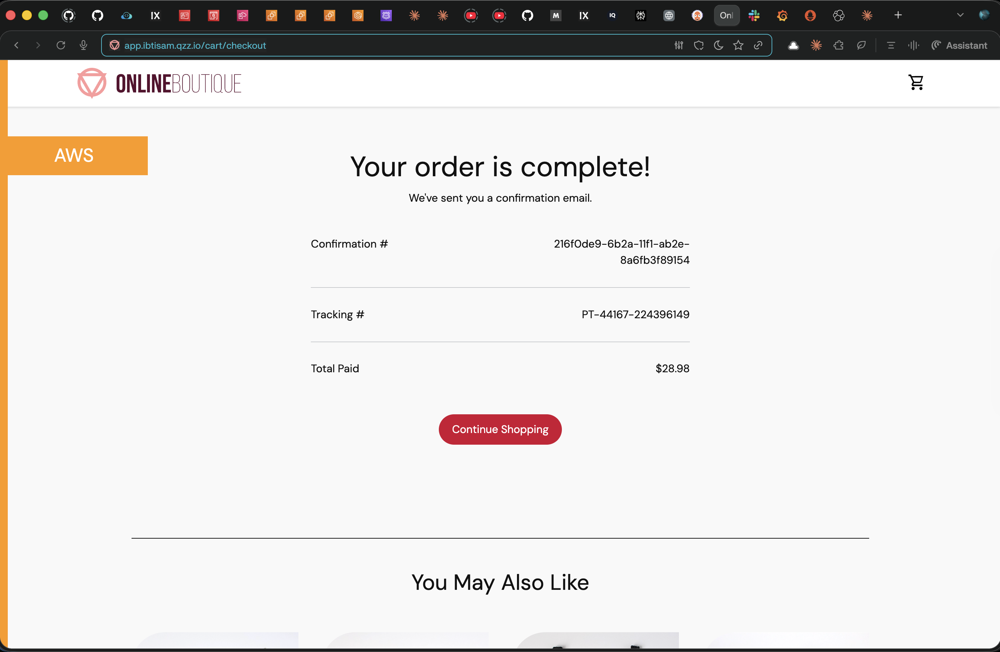
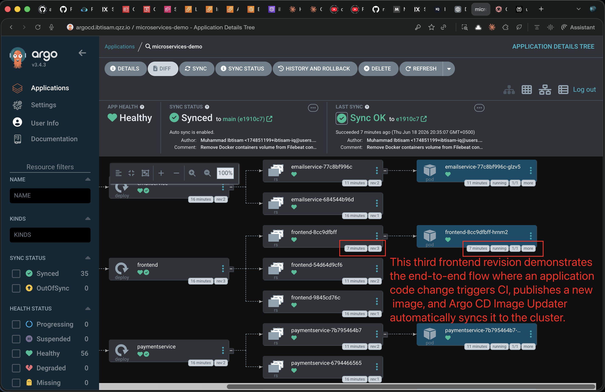
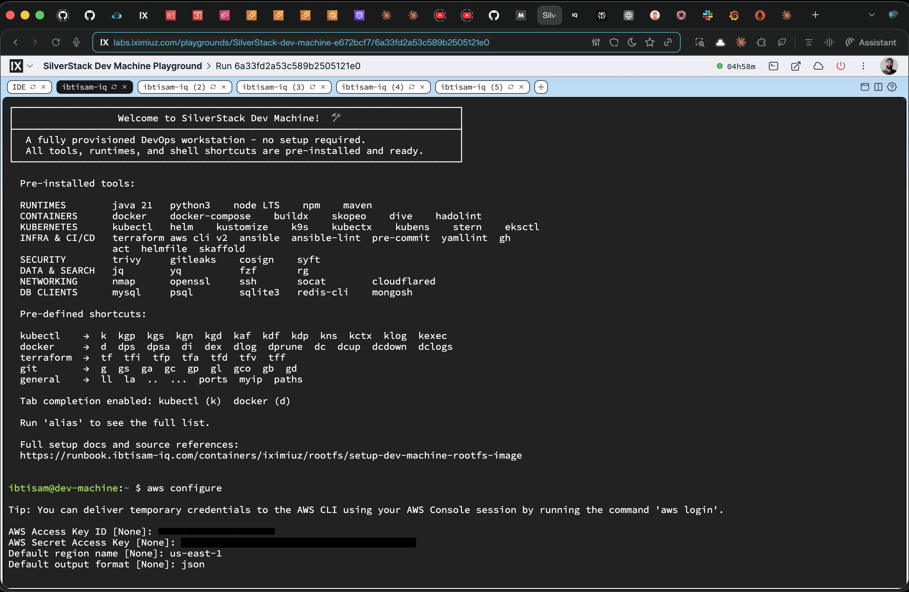

# Online Boutique on EKS: Production-Grade GitOps Pipeline

A 10-service polyglot microservices application deployed on Amazon EKS using a full DevSecOps CI pipeline (GitHub Actions + Trivy), GitOps continuous delivery (ArgoCD + Image Updater), observability (Prometheus + Grafana + ELK + Slack), and autoscaling (HPA). Forked from [GoogleCloudPlatform/microservices-demo](https://github.com/GoogleCloudPlatform/microservices-demo).

| Resource | Link |
|----------|------|
| **Runbook** | [runbook.ibtisam-iq.com/projects/deployments/microservices-demo](https://runbook.ibtisam-iq.com/projects/deployments/microservices-demo/) |
| **CD Repo** | [platform-engineering-systems](https://github.com/ibtisam-iq/platform-engineering-systems/tree/main/systems/microservices-demo) |
| **Infra Repo** | [silver-stack](https://github.com/ibtisam-iq/silver-stack/tree/main/terraform/aws/eks-kodekloud) |
| **Dev Machine** | [SilverStack Dev Machine on iximiuz](https://labs.iximiuz.com/playgrounds/SilverStack-dev-machine-e672bcf7) |
| **AWS Lab** | [KodeKloud AWS Playground](https://learn.kodekloud.com/user/playgrounds/playground-aws) (SCP-restricted, not a personal account) |
 
> [!NOTE]
> [SilverStack Dev Machine](https://labs.iximiuz.com/playgrounds/SilverStack-dev-machine-e672bcf7) is a custom root filesystem micro VM on [iximiuz Labs](https://labs.iximiuz.com/a/ibtisam-iq), built and maintained by me with all DevOps tools pre-installed (`kubectl`, `eksctl`, `terraform`, `helm`, `helmfile`, `aws cli`, etc.). No local machine setup required. See the [rootfs setup runbook](https://runbook.ibtisam-iq.com/containers/iximiuz/rootfs/setup-dev-machine-rootfs-image/) for how it is built.

---

## Architecture

```
Developer pushes to src/
    │
    ▼
GitHub Actions (this repo)
    ├── ci-trigger.yaml ─── detect changed services, fan out matrix
    ├── reusable-build.yaml ─── Trivy scan, Docker build, push to GHCR
    └── chart-release.yaml ─── package Helm chart, push to GHCR, update CD repo
          │
          ▼
GHCR (ghcr.io/ibtisam-iq/microservices-demo)
    ├── 10 service images (:sha-<40>, :sha-<7>, :latest)
    └── 1 Helm chart (oci://ghcr.io/ibtisam-iq/onlineboutique)
          │
          ▼
ArgoCD Image Updater (on EKS cluster)
    ├── Polls GHCR every 2 min
    ├── Detects new :latest digest
    └── Patches ArgoCD Application
          │
          ▼
ArgoCD syncs ─── pods roll ─── zero manual intervention

Platform:
    ├── Gateway API ─── 1 shared ALB, 5 HTTPRoutes, TLS via ACM wildcard cert
    ├── ExternalDNS ─── auto Route 53 records, 0 manual DNS entries
    ├── Prometheus + Grafana + AlertManager (Slack)
    ├── Elasticsearch + Filebeat + Kibana
    └── HPA on frontend (scales 1-5 based on CPU)

Subdomains (deployed and verified, then destroyed):
    app.ibtisam.qzz.io          Online Boutique frontend
    argocd.ibtisam.qzz.io       ArgoCD dashboard
    grafana.ibtisam.qzz.io      Grafana dashboards
    prometheus.ibtisam.qzz.io   Prometheus UI
    kibana.ibtisam.qzz.io       Kibana log search
```

### Proof of Deployment
 
The infrastructure was deployed on a KodeKloud AWS Playground, verified end to end, and then destroyed. Full terminal sessions and screenshots are recorded below.
 
| Online Boutique live at `app.ibtisam.qzz.io` | ArgoCD app tree after Image Updater rollout |
|---|---|
|  |  |
 

 
---

## What I Built

The upstream repo provides the application source code and Dockerfiles. Everything else, the CI pipeline, the deployment architecture, the observability stack, the autoscaling setup, was built from scratch.

| Phase | What I Built | Where |
|-------|-------------|-------|
| 1 | **DevSecOps CI Pipeline**: 3 GitHub Actions workflows, Trivy FS + image scanning, monorepo change detection, matrix builds, GHCR publish | [`.github/workflows/`](.github/workflows/) |
| 2 | **AWS Infrastructure**: Route 53, ACM wildcard cert, VPC, EKS cluster, bastion host, self-managed nodes via Terraform | [silver-stack](https://github.com/ibtisam-iq/silver-stack/tree/main/terraform/aws/eks-kodekloud) |
| 3 | **Cluster Add-ons**: ALB Controller (Gateway API enabled), EBS CSI + gp3, Gateway API (GatewayClass + Gateway), ExternalDNS | [CD repo/addons](https://github.com/ibtisam-iq/platform-engineering-systems/tree/main/systems/microservices-demo/addons) |
| 4 | **GitOps with ArgoCD**: ArgoCD + Image Updater (digest strategy), Application manifest, Kustomization + patch-only Helm values, HTTPRoutes | [CD repo](https://github.com/ibtisam-iq/platform-engineering-systems/tree/main/systems/microservices-demo) |
| 5 | **Observability**: kube-prometheus-stack (Slack alerts), ELK stack (Elasticsearch + Filebeat + Kibana), all exposed via HTTPRoutes | [CD repo/addons](https://github.com/ibtisam-iq/platform-engineering-systems/tree/main/systems/microservices-demo/addons) |
| 6 | **Autoscaling and Verification**: Metrics Server, HPA on frontend, load testing, full cluster audit | [CD repo/manifests](https://github.com/ibtisam-iq/platform-engineering-systems/tree/main/systems/microservices-demo/manifests) |

---

## Fork Strategy

I didn't modify upstream files. The fork stays pristine and syncable. All customization lives in files I add alongside upstream:

- **This repo**: 3 workflow files in `.github/workflows/`, terminal sessions in `terminal-session/`, screenshots in `assets/`
- **CD repo**: all deployment manifests, Helm values, HTTPRoutes, ArgoCD CRs, add-on configs

The upstream `src/`, `helm-chart/`, and `templates/` directories remain untouched.

---

## CI Pipeline

Three workflows, triggered independently:

| Workflow | Trigger | What It Does |
|----------|---------|-------------|
| [`ci-trigger.yaml`](.github/workflows/ci-trigger.yaml) | `src/**` changes | Detects changed services via `git diff`, fans out matrix builds |
| [`reusable-build.yaml`](.github/workflows/reusable-build.yaml) | Called per service | Trivy FS scan, Docker build (BuildKit + GHA cache), Trivy image scan, push 3 tags to GHCR |
| [`chart-release.yaml`](.github/workflows/chart-release.yaml) | `helm-chart/**` changes | `helm package` + `helm push` to GHCR, update chart version in CD repo |

CI does not touch the cluster. ArgoCD Image Updater handles deployments by watching GHCR for new image digests.

---

## Key Engineering Decisions

| Decision | Rationale |
|----------|-----------|
| **Image Updater (digest strategy)** over SHA-based GitOps | CI pushes and stops. No CD repo commits per code push. BuildKit epoch timestamps break `newest-build`, so `digest` strategy tracks `:latest` tag's digest directly. |
| **Gateway API** over Ingress | Kubernetes project recommends Gateway. Ingress API is frozen. Single shared ALB serves 5 subdomains. |
| **Patch-only Helm values** (5 fields) | Only deltas from upstream. If the default is correct, it is not listed. |
| **ArgoCD manages app, not platform** | If ArgoCD breaks, Prometheus and Grafana remain operational for debugging. |
| **Trivy CRITICAL gate** (temporarily relaxed) | Designed as exit-code 1. Set to 0 because upstream base images carry known CRITICALs. Restore once patched. |
| **Wildcard ACM cert** (`*.ibtisam.qzz.io`) | One cert for all subdomains. No new cert when a subdomain is added. |

Full decision log (24 decisions): [runbook index](https://runbook.ibtisam-iq.com/projects/deployments/microservices-demo/#key-decisions)

---

## Tech Stack

| Layer | Tools |
|-------|-------|
| CI | GitHub Actions, Trivy, Docker BuildKit, GHCR |
| IaC | Terraform (VPC, EKS, bastion), CloudFormation (self-managed nodes) |
| CD | ArgoCD, ArgoCD Image Updater (digest strategy) |
| Networking | Gateway API, AWS ALB Controller, ExternalDNS, ACM, Route 53 |
| Packaging | Helm (OCI), Kustomize (with `--enable-helm`) |
| Monitoring | Prometheus, Grafana, AlertManager (Slack) |
| Logging | Elasticsearch (ECK), Filebeat, Kibana |
| Autoscaling | Metrics Server, HPA |
| Cluster | Amazon EKS, self-managed nodes, gp3 EBS CSI |

---

## Runbooks

Detailed phase-by-phase documentation with commands, decisions, bugs, and troubleshooting steps.

| Phase | Runbook | What It Covers |
|-------|---------|----------------|
| 1 | [CI Pipeline and DevSecOps](https://runbook.ibtisam-iq.com/projects/deployments/microservices-demo/ci/) | GitHub Actions workflows, Trivy scanning, GHCR image and chart publish |
| 2 | [AWS Infrastructure](https://runbook.ibtisam-iq.com/projects/deployments/microservices-demo/aws-infrastructure/) | DNS, ACM certificate, VPC, EKS cluster, bastion host, self-managed nodes |
| 3 | [Cluster Add-ons and Gateway API](https://runbook.ibtisam-iq.com/projects/deployments/microservices-demo/cluster-addons/) | ALB Controller, EBS CSI, Gateway API, ExternalDNS |
| 4 | [GitOps with ArgoCD](https://runbook.ibtisam-iq.com/projects/deployments/microservices-demo/gitops-argocd/) | ArgoCD, Application manifest, Image Updater, CI-CD integration |
| 5 | [Observability Stack](https://runbook.ibtisam-iq.com/projects/deployments/microservices-demo/observability/) | kube-prometheus-stack, ELK stack, Slack alerting, HTTPRoutes |
| 6 | [Autoscaling, Load Testing, and Verification](https://runbook.ibtisam-iq.com/projects/deployments/microservices-demo/autoscaling/) | Metrics Server, HPA, scaling validation, full cluster audit |

---

## Terminal Sessions

Every step was recorded. The terminal sessions capture the exact commands, outputs, and errors encountered during the build.

| # | Session | Phase |
|---|---------|-------|
| 01 | [`01_dns_and_ssl_certificate_setup.txt`](terminal-session/01_dns_and_ssl_certificate_setup.txt) | 2 |
| 01a | [`01a_cluster_provisioning_with_terraform.txt`](terminal-session/01a_cluster_provisioning_with_terraform.txt) | 2 |
| 02 | [`02_bastion_access_tool_installation_and_self_managed_nodes.txt`](terminal-session/02_bastion_access_tool_installation_and_self_managed_nodes.txt) | 2 |
| 03 | [`03_cluster_addons_installation.txt`](terminal-session/03_cluster_addons_installation.txt) | 3 |
| 04 | [`04_application_deployment_and_ci_trigger.txt`](terminal-session/04_application_deployment_and_ci_trigger.txt) | 4 |
| 05 | [`05_kube_prometheus_stack_monitoring.txt`](terminal-session/05_kube_prometheus_stack_monitoring.txt) | 5 |
| 06 | [`06_elastic_stack_logging.txt`](terminal-session/06_elastic_stack_logging.txt) | 5 |
| 07 | [`07_observe_scaling_behavior_and_validate_reliability.txt`](terminal-session/07_observe_scaling_behavior_and_validate_reliability.txt) | 6 |
| 08 | [`08_verification_of_pods_services_and_resources.txt`](terminal-session/08_verification_of_pods_services_and_resources.txt) | 6 |

---

## Screenshots

Complete inventory of all verification evidence captured during deployment.

| # | Screenshot | Phase |
|---|------------|-------|
| 01 | [`01_silverstack_dev_machine.png`](assets/01_silverstack_dev_machine.png) - SilverStack dev machine on iximiuz | 2 |
| 02 | [`02_aws_eks_cluster_compute_self_managed_nodes.png`](assets/02_aws_eks_cluster_compute_self_managed_nodes.png) - EKS cluster with self-managed nodes | 2 |
| 03 | [`03_online_boutique_web_view.png`](assets/03_online_boutique_web_view.png) - Live app at app.ibtisam.qzz.io | 4 |
| 04 | [`04_argo_app_tree_image_updater_frontend_revision.png`](assets/04_argo_app_tree_image_updater_frontend_revision.png) - ArgoCD app tree after Image Updater rollout | 4 |
| 05 | [`05_prometheus_kube_prometheus_stack_target_health.png`](assets/05_prometheus_kube_prometheus_stack_target_health.png) - Prometheus targets all healthy | 5 |
| 06 | [`06_grafana_boutique_app_pod_metrics_dashboard.png`](assets/06_grafana_boutique_app_pod_metrics_dashboard.png) - Grafana pod metrics dashboard | 5 |
| 07 | [`07_kibana_boutique_app_logs_discover_view.png`](assets/07_kibana_boutique_app_logs_discover_view.png) - Kibana logs from all pods | 5 |
| 08 | [`08_argo_app_tree_hpa_frontend_scale_out.png`](assets/08_argo_app_tree_hpa_frontend_scale_out.png) - ArgoCD HPA scale-out | 6 |
| 09 | [`09_route53_records_externaldns_reconciliation.png`](assets/09_route53_records_externaldns_reconciliation.png) - Route 53 auto-created DNS records | 3 |
| 10 | [`10_cloudformation_eks_addons_and_nodes_stacks.png`](assets/10_cloudformation_eks_addons_and_nodes_stacks.png) - CloudFormation stacks for EKS | 2 |
| 11 | [`11_aws_alb_listeners_and_rules_overview.png`](assets/11_aws_alb_listeners_and_rules_overview.png) - ALB listeners and routing rules | 3 |
| 12 | [`12_aws_alb_resource_map_routing_targets.png`](assets/12_aws_alb_resource_map_routing_targets.png) - ALB resource map with routing targets | 3 |

---

## Upstream

This repo is a fork of [GoogleCloudPlatform/microservices-demo](https://github.com/GoogleCloudPlatform/microservices-demo). The original application docs and service descriptions are available in the upstream repo.
